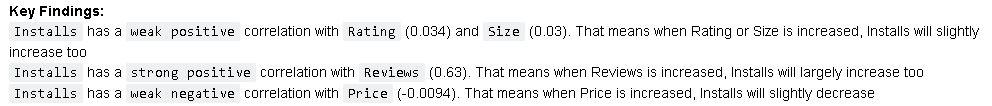
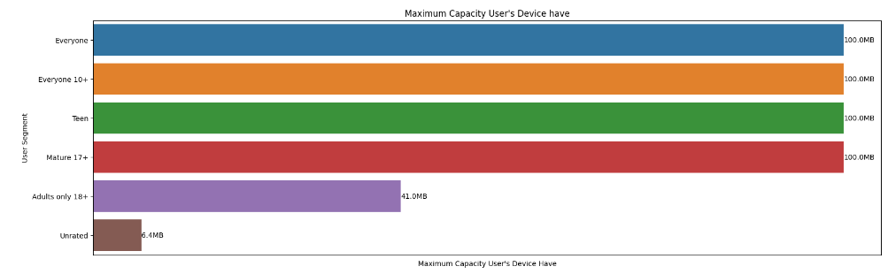
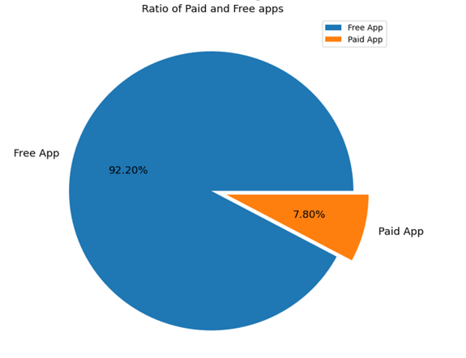
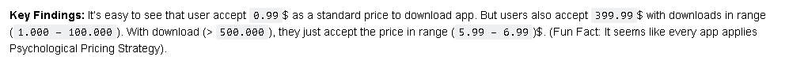

# App Market Analysis

# Table of contents
1. [Introcduction](#introduction)
2. [Understand data](#understand)
3. [Check data format](#format)
4. [Check data type](#type)
5. [Check data validation](#validation)
6. [Check null value](#null)
7. [Show correlation](#correlation)
8. [Problem statment](#problem)

## 1. Introduction 
People nowadays own a smartphone. That leads we to believe that app market has a numerous potential to invest. And Playstore
is a wonderful resource to gain more insights about that market. 

##  2. Understand data 
Here is my `explaination` about data:

And here is about the `number` of `rows` and `columns`:

##  3. Check data format 
After checking all unique values from each column, I find out:

### **`Size`, `Installs`, `Price` have a wrong format** ###

- Size  

- Installs  

- Price  

- We know that 1MB = 1024KB and we agree that  all units of `Size` into `MB`. Here is my result:  

### **`Genres` based on `Category`, but they don't match each other** ###

- Genres  

- Category  

- Here is my result:  

##  4. Check data type 
- Let's see data type of all columns:  

- We only need to solve `Installs`, `Size`, `Price`, `Last Updated`. Here is my result:  

##  5. Check data validation 
With the basic rule we know such as: `Rating` must be in `[0-5]` and `Reviews`, `Size`, `Installs` must be `positive number`. Here is my progress:

##  6. Check null value 
- Let's glance over the following picture:  

- Here is my key findings:  

- Now we solve null value in `Type`:  
  
Because this is a `categorical` data which just has `two` groups. So we will `replace` with its `mode`.

- It's `Android Ver`'s turn:  
  
Because this is a `categorical` data and there is` no particular` data that we can replace with it. Furthermore, it only takes `0.02%` of total rows from the given dataset so we can `remove` it.  
- We can handle `Current Ver` likes the way we handle Android Ver  
  
- For `Size`:  
  
Becasue this is a `numerical` data and it takes `12.7%` of total rows. If we drop them, it may `impact` the `data quality`. So we will replace them by `mean` / `median`. We need to check `data distribution`:  
  
It's clear that the Size is `Positive skew` / `right-skewed` -> we will `replace` null value in Size column with its `median` 

- For `Rating`:  
  
Becasue this is a `numerical` data and it takes `15%` of total rows. If we drop them, it may `impact` the `data quality`. So we will replace . We need to check `data distribution`:  
  
It's clear that the Size is `Negative skew` / `left-skewed` -> we will `replace` null value in Size column with its `median` 

##  7. Show correlation 
Here is a heat map chart:

And this is my key findings:

## 8. Problem statement 

**Question 1:** How much is maximum potential users for each target user that we can reach ? How much is maximum capacity that each target's device have ?
- The answer for the first question:  
  
- The answer for the second question:  

**Question 2:** Ratio of Free Apps vs Paid Apps ?

**Question 3:** How user consider "Affordable App" ?  
  
- Here is my key findings:  

**Question 4:** Which category attracts user most ?

  
- Here is my key findings:  

**Question 5:** Most popular apps will probably have a high rating ?

- Here is my key findings:

